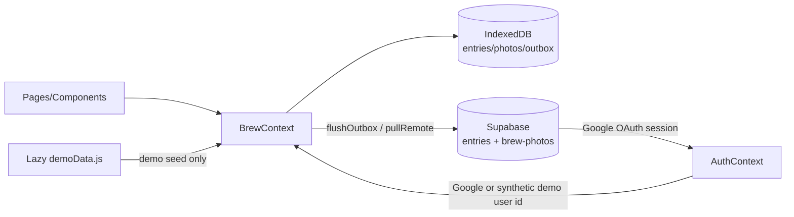

# my-brew-log Architecture Documentation

## 1. How to Read This Document

This is the architectural single source of truth for my-brew-log, read at the start of every TRIP task. It describes what exists today — not an idealized design. Update it per `ARCHI-rules.md` after any architectural change.

## 2. Overview

my-brew-log is an **offline-first PWA** for logging coffee/matcha/tea intake, designed to be installed on an iPhone home screen. Entries (name, type, rating, notes, photo, extracted color) are stored locally in IndexedDB and synced to Supabase when online. A no-sign-in demo mode uses the same local stack with a synthetic user and seeded entries, but never syncs. A layered "daily cup" visualization, photo streaks, and switchable themes make up the personality of the app.

- **Project type**: Web Frontend (React SPA / PWA) with a Supabase backend-as-a-service
- **Current version**: 0.4.1 (`package.json`)
- **Deployment**: Vercel (static SPA with rewrite-to-index), service worker for offline

## 3. Technology Stack

| Layer | Technology |
| --- | --- |
| UI | React 19, JSX (no TypeScript) |
| Build | Vite 8 (`npm run dev/build/preview`) |
| Routing | react-router-dom 7 (`BrowserRouter`) |
| Animation | framer-motion 12 (page transitions, bottom sheet) |
| Backend | Supabase (Google OAuth, Postgres `entries` table, Storage bucket `brew-photos`) |
| Local persistence | IndexedDB via `idb` 8 (per-user DB `brew-log-<userId>`) |
| Testing | Vitest 4, node environment, `src/**/*.test.js`, `fake-indexeddb` for cache tests |
| Lint | ESLint 10 flat config + react-hooks + react-refresh plugins |
| Icons/assets | `sharp` build script (`scripts/generate-icons.mjs`), PWA manifest + `sw.js` in `public/` |

## 4. Project Structure

```
src/
├── main.jsx              # Entry: applies stored theme pre-render, registers/unregisters SW
├── App.jsx               # Providers (Auth, Brew) + AnimatePresence routes
├── index.css             # Global styles, theme CSS variable blocks
├── pages/
│   ├── FeedPage.jsx      # "/" — DailyCup, streak chip, entry list, calendar link, demo state
│   ├── AddPage.jsx       # "/add" — new entry form, photo + color picker
│   ├── DetailPage.jsx    # "/entry/:id" — inline per-field editing
│   ├── CalendarPage.jsx  # "/calendar" — month grid (brew-day dots), day list + day mug
│   └── LoginPage.jsx     # Google OAuth sign-in
├── components/           # DailyCup, EntryCard, StarRating, PhotoPicker, ColorPicker, ThemePicker, BackupControls, LocationField, DemoBanner, SyncErrorChip
├── context/
│   ├── AuthContext.jsx   # Supabase/demo session state, signInWithGoogle/signOut
│   └── BrewContext.jsx   # Entry CRUD, cache + sync orchestration
├── lib/
│   ├── supabase.js       # Client from VITE_SUPABASE_URL / VITE_SUPABASE_ANON_KEY
│   ├── cache.js          # IndexedDB: entries / photos (Blobs) / outbox stores
│   ├── sync.js           # toRow/fromRow mapping, partial updates, flushOutbox, pullRemote
│   ├── photoCodec.js     # dataURL <-> Blob (Node-compatible for tests)
│   ├── demo.js           # Demo timestamps, seed-row builders, and cache seeding
│   ├── demoData.js       # Generated lazy-loaded demo brew specs and photo data
│   └── theme.js          # Five-theme table, persistence (localStorage brewlog:theme), DOM application
└── utils/                # compressImage, extractColor, recentLocations, streakCalc, dropSound, brewTypes, calendar, datetimeLocal
scripts/
├── generate-icons.mjs
└── extract-demo-photos.mjs      # Dev-only backup photo extractor
```

## 5. Core Architecture Principles

- **Offline-first**: all reads/writes hit IndexedDB first; the UI never blocks on the network.
- **Outbox pattern**: mutations append `{ seq, op, entry }` to an ordered `outbox` store; `flushOutbox` replays `add`, whitelisted partial `update`, and `delete` operations against Supabase when connectivity/auth allows, while `pullRemote` reconciles remote rows back into the cache. The `update` op carries a canonical patch over a fixed set of editable client fields (`name`, `type`, `rating`, `notes`, `timestamp`, `location`), normalized by `normalizePatch` and mapped symmetrically by `toPatchRow`/`applyPatch` — it never touches photo storage or `photo_path`. Pending update patches are overlaid on pulled rows, and a sync requested during an active pass queues one follow-up pass, so edits made mid-sync are neither reverted nor stranded. A row deleted on another device wins over a local edit (delete-wins): the `update` matches zero rows, the op is dropped, and the next pull prunes the local entry. Flushes visit ops in `seq` order and skip later ops only for an entry whose earlier op failed, preserving add→update→delete causal order while allowing other entries to proceed; failed ops remain queued and the summary reports `flushed`, blocked-entry `failed`, non-blocking photo `cleanupFailed`, and the first `error`. Photo uploads use `upsert: false` and treat duplicate/409 results as success, while delete cleanup failures do not pin an already-authoritative row delete. Pulls cache rows even when a photo download fails and report a soft `photoFailed` signal.
- **Per-user isolation**: IndexedDB database name is `brew-log-<userId>`; switching accounts switches databases.
- **Demo isolation**: demo mode exposes the synthetic user `{ id: 'demo', email: 'demo@brew.log', isDemo: true }`, opens `brew-log-demo`, reseeds its entries/photos on open, and makes `BrewContext.runSync` a no-op. Demo mutations can remain in that cache's outbox, which is cleared on the next reseed and is never flushed to Supabase.
- **Context over state libraries**: `AuthContext` and `BrewContext` are the only global state; no Redux/Zustand.
- **Plain JS + JSDoc**: no TypeScript; validation is runtime (`isValidEntry`).

## 6. Data Model

Client entry shape (see `isValidEntry` in `BrewContext.jsx` and `toRow`/`fromRow` in `sync.js`):

```js
{
  id: string,          // uuid
  name: string,
  type: string|null,   // coffee / matcha / tea
  rating: number|null,
  notes: string|null,
  color: string|null,  // hex extracted from photo
  location?: string,   // free-text place label; absent when unset
  timestamp: number,   // ms epoch; maps to logged_at ISO column
  hasPhoto: boolean,   // derived from photo_path on the row
}
```

`locationMeta` is reserved for a future structured map location (`{ lat, lng, placeId?, provider? }`) and is not implemented yet.

Supabase: `entries` table keyed by `id` with `user_id`, photos in Storage bucket `brew-photos` referenced by `photo_path`.

Demo rows use the same cached-row shape and photo store as real entries. Their stable ids use the `demo-brew-*` namespace and are re-dated to the current local day; no persisted schema or Supabase mapping changes are required.

## 7. Data Flow



Add-entry path: AddPage → compressImage + extractColor → `addEntry` (BrewContext) → cache put + outbox append → background flush to Supabase (row upsert + photo Blob upload).

## 8. Configuration

- `.env` / `.env.example`: `VITE_SUPABASE_URL`, `VITE_SUPABASE_ANON_KEY` (public anon key only — no secrets in the client).
- `vercel.json`: SPA rewrite of all routes to `index.html`.
- Themes: `src/lib/theme.js` table (id, swatches, optional Google Fonts href), persisted under `localStorage['brewlog:theme']`, applied before first paint in `main.jsx`.
- Demo mode: `AuthContext` persists its session flag under `localStorage['brewlog:demo']`; `src/lib/demoData.js` is dynamically imported during seeding so its photo payload is a lazy chunk.

## 9. Error Handling Strategy

- Missing Supabase env vars log a clear console error instead of failing cryptically.
- Sync failures leave items in the outbox for retry; the UI keeps working from cache. `BrewContext` exposes `syncError` and `retrySync`, and real-user feeds show an error-only retry chip when a flush fails, delete photo cleanup fails, a remote query fails, or a photo download is incomplete. A fully clean pass clears the chip; demo mode never syncs or shows it.
- Entry validation (`isValidEntry`) guards against malformed cached/remote data.

For the July account-consolidation recovery, read the iPhone's displayed account before signing out. If it is the canonical account, flush that account's local outbox; otherwise import the verified backup on a device signed into the canonical account before switching the iPhone. Per-user IndexedDB isolation means switching accounts does not move local entries. Verify the final row count in Supabase rather than relying only on a device cache.

## 10. Testing Strategy

- **Framework**: Vitest, `environment: 'node'`, files matching `src/**/*.test.js`.
- **Covered**: pure/lib logic — `cache.js` (via `fake-indexeddb`), `sync.js`, `photoCodec.js`, `theme.js`, `utils/streakCalc.js`.
- **Not covered**: React components/pages (no jsdom/RTL setup), service worker, OAuth flow.
- Commands: `npm test` (vitest run), `npx vitest run <pattern>` for a subset.

## 11. Performance Considerations

- Photos are compressed client-side (`compressImage`) before caching/upload.
- Theme applied pre-render to avoid palette flash; fonts lazy-loaded per theme.
- Demo photos stay in the dynamically imported `demoData.js` chunk; the service worker's runtime GET caching retains that chunk after an online demo load.
- Service worker caches the built app for offline start (`public/sw.js`, cache `brew-log-v2`); dev mode actively unregisters SWs to avoid stale-module traps. The SW **never caches Supabase requests** (`*.supabase.co` is bypassed to the network) — a prior cache-first hit served a stale entries response indefinitely and hid new server data; only same-origin app assets and Google Fonts are cached. On SW update, `main.jsx` listens for `controllerchange` and triggers one resync (via the `online` wake event) so fresh data loads under the new worker without a page reload.

## 12. Deployment

- `npm run build` → `dist/`, deployed to Vercel (`.vercel/` project linked).
- **Deploy is manual**: `git push` to `main` does **not** update production — deploy explicitly with `vercel --prod`. A merged/pushed release (TRIP-3 ends at push) is not live until then. Always verify the live build after deploying, e.g. `curl -s https://my-brew-log.vercel.app/sw.js | grep CACHE_NAME`. (A v0.4.1 fix once sat un-deployed while its symptoms were debugged on-device — push ≠ live.)
- PWA installability via `public/manifest.json` + icons generated by `scripts/generate-icons.mjs`.
- Git: `main` is the default branch; feature branches (`feat/*`) merge back fast-forward.

## 13. Conclusion

A deliberately small offline-first React PWA: two contexts, an IndexedDB outbox, and Supabase as the sync target, with a synthetic local-only demo session layered over the same cache and pages. The riskiest areas for any change are the sync/outbox ordering, per-user cache isolation, photo blob handling, and the demo sync gate — treat those as the critical paths in planning and review.
